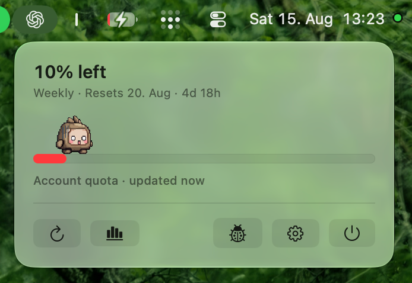
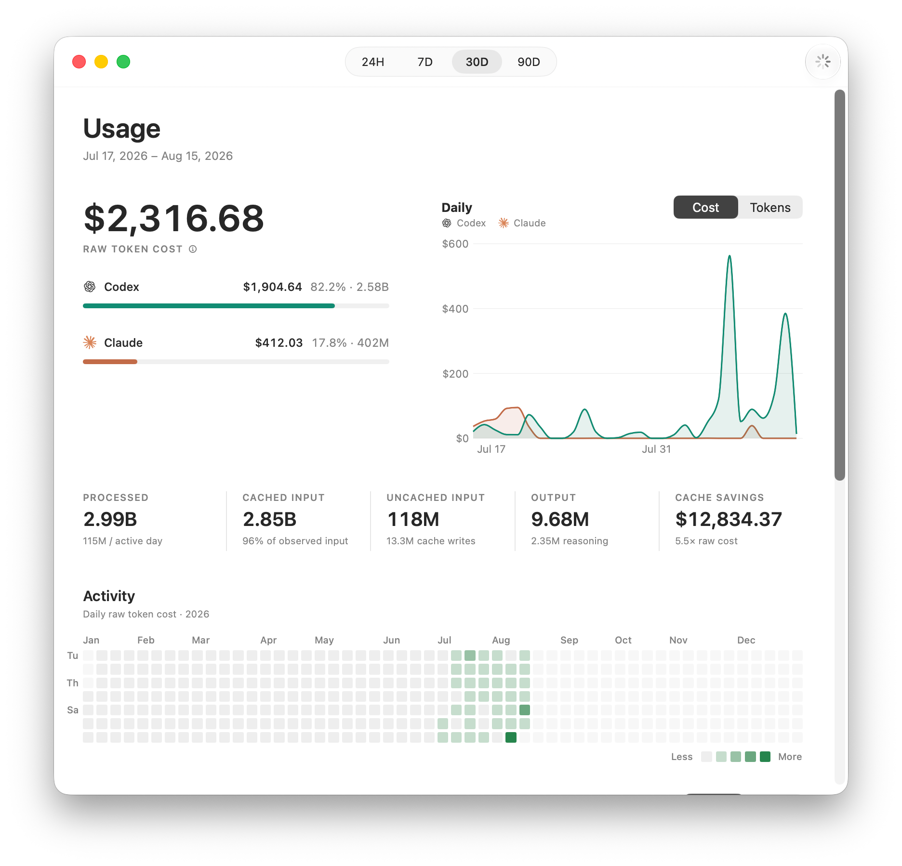

<div align="center">
  
  <h1>Quotakin</h1>
  <p>Your Claude and Codex usage, living quietly in the menu bar.</p>
  <p><strong>macOS 26 or later</strong></p>
</div>



## Know your usage before it becomes a surprise

- See five-hour and weekly limits.
- Know when each window resets and whether usage is on pace.
- Open History for activity, models, tokens, and estimated cost.
- Choose a small quota companion for the menu bar!

**[Download Quotakin for macOS →](https://github.com/richarddemann/quotakin/releases/latest/download/Quotakin.dmg)**

<br clear="right">

## Download

**[Download Quotakin for macOS](https://github.com/richarddemann/quotakin/releases/latest/download/Quotakin.dmg)**

Open the DMG and drag Quotakin into Applications.

Or install it with Homebrew:

```sh
brew install --cask richarddemann/tap/quotakin
```

> Quotakin is not Apple-notarized. On first launch, right-click the app and choose **Open**. If macOS still blocks it, go to **System Settings → Privacy & Security → Open Anyway**. Managed Macs may not permit unnotarized apps.

## See where the tokens went

<p align="center">
  
</p>

Quotakin reads local Claude Code and Codex usage records to build a daily history. Connect either provider (or both) when you also want live account quota.

Choose a small quota companion for the menu bar, switch to a simpler display, and optionally get an alert before capacity becomes tight.

## Private by design

Your prompts and responses stay out of Quotakin. Summary usage data stays on your Mac, provider credentials and cookies are not copied, and account checks only begin after you choose **Connect** or **Check**.

[Privacy details](docs/PRIVACY.md)

## Updates

Quotakin can check for new versions inside the app. Release archives and updates are signed with Quotakin's Sparkle update key.

## Build from source

Quotakin is a native Swift app. See [Building and testing](docs/BUILDING.md) to run it from source.

## License

[MIT](LICENSE)
